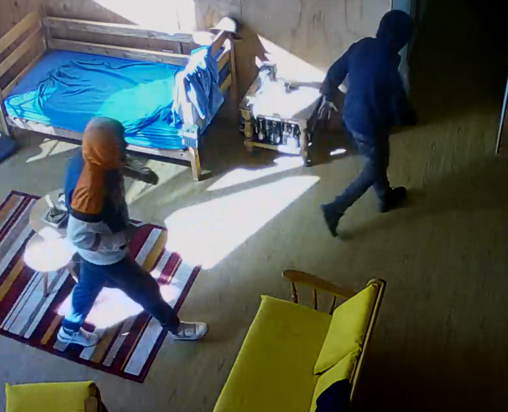
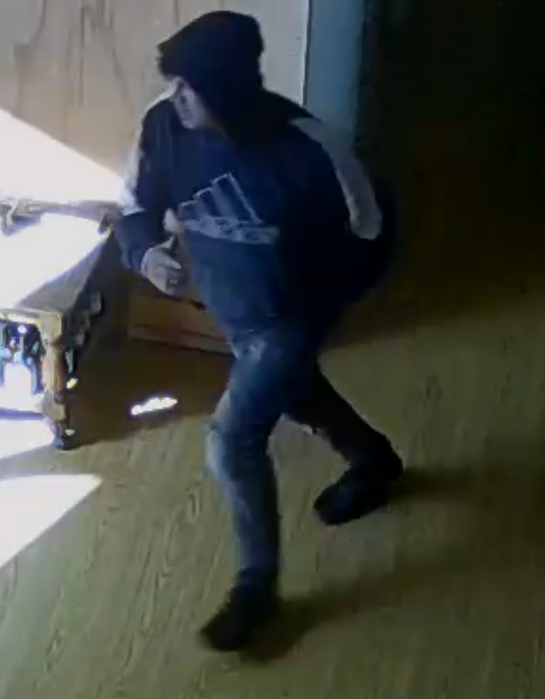

# Recopilación de Datos de Robo

## Lugar del robo

Robo de lugar habitado con fecha 27-08-2024 a las 14:11 hrs. forzado de y rotura de
puestas, robo de enceres y vehículos ATV.

Sector Tabolango Ruta F630 altura del km 0700 (700 mt del Cristo de Tabolango), Limache.
antecendentes denuncia _Parte *Nro 1766*_

### video del robo

- [ver video forcejeo](./VIDEO_2024-08-27_14.11hrs_inicio_robo.mp4)
- [ver video ingreso](./VIDEO_2024-08-27_14.14hrs_acceso_forzado.mp4)

### Ubicación del Robo

[locación google maps](https://maps.app.goo.gl/58wpxTvFEtXESE5K9)

### Sospechosos

 

 

### Contacto

puedes escribirme enviando un

> - [whatsapp](https://wa.me/56948611376?text=Por%20el%20asunto%20del%20robo)
> - [o enviado un correo](mailto:crcamposn@gmail.com?subject=Información%20Robo&cc=ccamposn@minenergia.cl)
